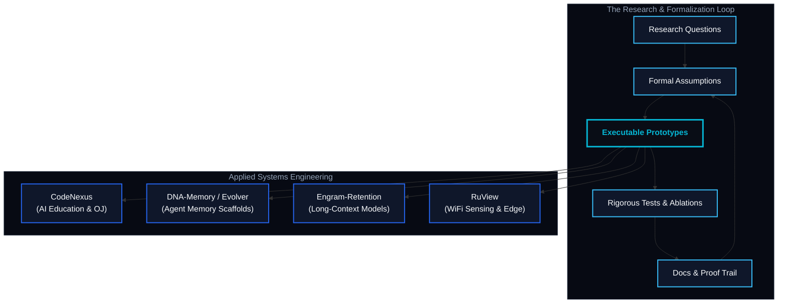

<div align="center">


[](https://git.io/typing-svg)

[](https://github.com/XXY-CH)
[](https://github.com/XXY-CH?tab=followers)
[](https://doi.org/10.5281/zenodo.20041183)
[](mailto:cachoidxx@gmail.com)

</div>

---

## 🧠 About Me

> **I build research-shaped systems**: online judges that understand teaching data, AI-agent infrastructure that can inspect and improve code, and memory-centric modeling experiments that try to make long-context reasoning cheaper, sharper, and more auditable.
> 
> My favorite work lives at the boundary where a mathematical claim has to become a running system: proofs, tests, architecture diagrams, telemetry, and a repository that another engineer can actually clone, compile, and reproduce.

---

## 🎯 Core Research Lanes

| Lane | Initiative & System Scope | Active Repository |
| :--- | :--- | :--- |
| **🧠 Long-Context AI** | RetNet-style retention, Engram lookup, Block Attention Residuals, milestone snapshots | [`engram-retention`](https://github.com/XXY-CH/engram-retention) |
| **🎓 AI Education** | Online judge platform for school teaching, evaluation, and AI-assisted governance | [`CodeNexus`](https://github.com/XXY-CH/CodeNexus) |
| **🔄 Agent Memory** | Systems where agents learn, forget, route, and self-improve over time | [`dna-memory`](https://github.com/XXY-CH/dna-memory) / [`evolver`](https://github.com/XXY-CH/evolver) / [`mindx`](https://github.com/XXY-CH/mindx) |
| **👥 Multi-Agent** | Interactive classrooms and coordination surfaces for AI-assisted learning | [`OpenMAIC`](https://github.com/XXY-CH/OpenMAIC) |
| **📡 Edge & Signals** | WiFi sensing, inference pipelines, and non-visual perception systems | [`RuView`](https://github.com/XXY-CH/RuView) |

---

## 💡 Featured Repositories

<div align="center">
  <table width="100%">
    <tr>
      <td width="50%" valign="top" style="border: 1px solid #1e293b; border-radius: 8px; padding: 16px; background-color: #0b0f19;">
        <div align="left">
          
          <h3>💡 <a href="https://github.com/XXY-CH/engram-retention" style="text-decoration: none; color: #38bdf8;">Engram Retention</a></h3>
          <p style="color: #94a3b8; font-size: 14px; line-height: 1.5;">PyTorch research scaffold for budgeted long-context memory: RetNet recurrence, hashed Engram lookup, Block Attention Residuals, and milestone snapshots.</p>
          <p style="margin-top: 12px;">
            
            
            
          </p>
        </div>
      </td>
      <td width="50%" valign="top" style="border: 1px solid #1e293b; border-radius: 8px; padding: 16px; background-color: #0b0f19;">
        <div align="left">
          
          <h3>🚀 <a href="https://github.com/XXY-CH/CodeNexus" style="text-decoration: none; color: #38bdf8;">CodeNexus</a></h3>
          <p style="color: #94a3b8; font-size: 14px; line-height: 1.5;">An AI-native online judge platform designed for school teaching, judging, integrity workflows, and educational data intelligence.</p>
          <p style="margin-top: 12px;">
            
            
            
          </p>
        </div>
      </td>
    </tr>
  </table>
</div>

---

## 🗺️ System Map



---

## 🛠️ The System & Research Stack

<div align="center">

| Layer | Technologies & Frameworks |
| :--- | :--- |
| **🚀 Core Systems & Languages** |      |
| **🧠 Deep Learning & AI Research** |     |
| **💾 Infrastructure & Pipelines** |     |

</div>

---

## 📐 Engineering Taste & Axioms

> *"Simplicity is a prerequisite for reliability."* — Edsger W. Dijkstra

*   **Executable First**: Start with the actual running system, not a slogan or an empty abstraction.
*   **Ablated & Proven**: Keep claims narrow and humble until comprehensive tests and rigorous ablations make them stronger.
*   **Falsifiable Architectures**: Design architectures that can be actively inspected, systematically reproduced, and disproven.
*   **Evidence-Centric AI**: Build AI features around solid empirical evidence, auditability, and governance workflows, not just chat wrappers.
*   **Documentation as Code**: Treat system documentation and formal proof trails as core components, never as packaging after the fact.

---

## 📊 System Telemetry & Signal

```yaml
host: XXY-CH@github
status: active
repositories: 19 public
focus_areas: [Engram Retention, CodeNexus, OpenMAIC, RuView]

[Languages by Repo Count]
JavaScript  ████████████████ 4
C++         ████████████ 3
Python      ████████████ 3
Rust        ████████████ 3
TypeScript  ████████████ 3
Go          ████ 1
```

| Domain | Center of Gravity | Description |
| :--- | :--- | :--- |
| **🧠 Research Code** | `engram-retention` | Keeps proofs, configs, tests, and citation metadata unified in a single reproducible PyTorch scaffold. |
| **⚙️ Systems Code** | `CodeNexus` | Pushes AI-native online judging from simple sandbox testing to real-world educational workflows. |
| **🔄 Agent Scaffolds** | `dna-memory` / `evolver` | Explore the practical bounds of adaptive memory, routing, and self-evolution. |
| **🌐 Interface Surfaces** | `OpenMAIC` | Experiments with multi-agent orchestration and coordination spaces. |

> [!NOTE]
> This telemetry panel is rendered statically to prevent dynamic API outages (e.g., 503 errors from external README card services) and maintain optimal loading performance.

---

## 📬 Contact & Connection

*   **Email**: [cachoidxx@gmail.com](mailto:cachoidxx@gmail.com)
*   **GitHub Profile**: [github.com/XXY-CH](https://github.com/XXY-CH)

<div align="center">


</div>
