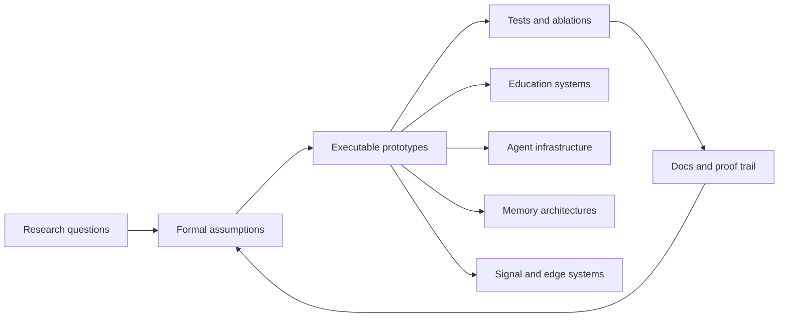

<div align="center">


[](https://git.io/typing-svg)

[](https://github.com/XXY-CH)
[](https://github.com/XXY-CH?tab=followers)
[](https://doi.org/10.5281/zenodo.20041183)
[](mailto:cachoidxx@gmail.com)

</div>

## About

I build research-shaped systems: online judges that understand teaching data,
AI-agent infrastructure that can inspect and improve code, and memory-centric
modeling experiments that try to make long-context reasoning cheaper, sharper,
and more auditable.

My favorite work lives at the boundary where a mathematical claim has to become
a running system: proofs, tests, architecture diagrams, telemetry, and a repo
that another engineer can actually reproduce.

## Current Focus

| Lane | What I am building | Public signal |
|---|---|---|
| Long-context AI research | RetNet-style retention, Engram lookup, Block Attention Residuals, milestone snapshots | [engram-retention](https://github.com/XXY-CH/engram-retention) |
| AI-native education systems | Online judge platform for school teaching, evaluation, and AI-assisted governance | [CodeNexus](https://github.com/XXY-CH/CodeNexus) |
| Agent memory and evolution | Systems where agents learn, forget, route, and self-improve over time | [dna-memory](https://github.com/XXY-CH/dna-memory), [evolver](https://github.com/XXY-CH/evolver), [mindx](https://github.com/XXY-CH/mindx) |
| Multi-agent learning | Interactive classrooms and coordination surfaces for AI-assisted learning | [OpenMAIC](https://github.com/XXY-CH/OpenMAIC) |
| Edge and signal systems | WiFi sensing, inference pipelines, and non-visual perception systems | [RuView](https://github.com/XXY-CH/RuView) |

## Featured Repositories

<table>
  <tr>
    <td width="50%">
      <h3><a href="https://github.com/XXY-CH/engram-retention">Engram Retention</a></h3>
      <p>PyTorch research scaffold for budgeted long-context memory: RetNet recurrence, hashed Engram lookup, Block Attention Residuals, and milestone snapshots.</p>
      <p>
        
        
        
      </p>
    </td>
    <td width="50%">
      <h3><a href="https://github.com/XXY-CH/CodeNexus">CodeNexus</a></h3>
      <p>An AI-native online judge platform designed for school teaching, judging, integrity workflows, and educational data intelligence.</p>
      <p>
        
        
        
      </p>
    </td>
  </tr>
</table>

## System Map



## Toolbox

<div align="center">


</div>

## Engineering Taste

- Start with the actual system, not a slogan.
- Keep claims narrow until tests make them stronger.
- Prefer architectures that can be inspected, reproduced, and falsified.
- Build AI features around evidence, governance, and workflows, not just chat.
- Treat documentation as part of the system, not packaging after the fact.

## GitHub Signal

<div align="center">


<br />


</div>

## Contact

```txt
Email:  cachoidxx@gmail.com
GitHub: https://github.com/XXY-CH
```

<div align="center">


</div>
