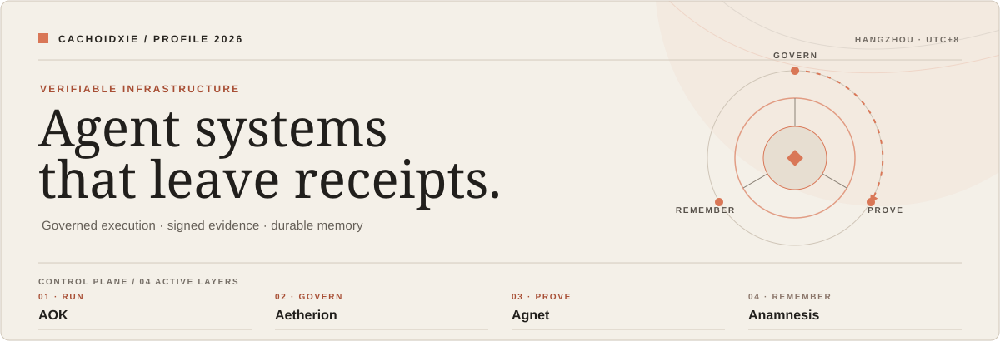
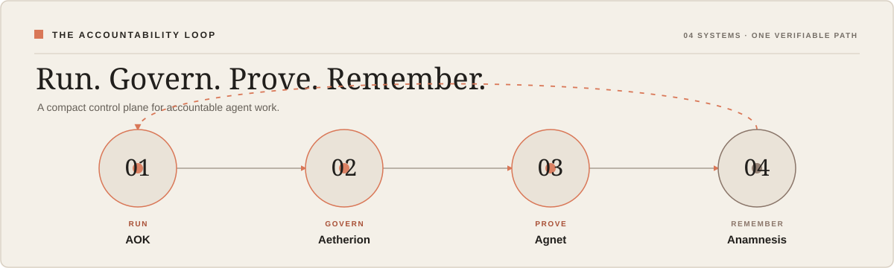

<picture>
  <source media="(prefers-color-scheme: dark)" srcset="assets/hero-dark.svg">
  <source media="(prefers-color-scheme: light)" srcset="assets/hero-light.svg">
  
</picture>

Agent systems that leave receipts — govern, prove, remember\.

## Flagship systems

| Repository | Role | Purpose |
| --- | --- | --- |
| [`Agnet`](https://github.com/XXY-CH/Agnet) | PROVE | Portable accountability infrastructure for agent identity, signed tasks, durable Swarms, artifacts, receipts, and independent verification\. |
| [`Aetherion`](https://github.com/XXY-CH/Aetherion) | GOVERN | Local-first agent harness kernel for policy, memory, event ledgers, capabilities, and governed tool execution\. |
| [`Anamnesis`](https://github.com/XXY-CH/Anamnesis) | REMEMBER | Proof-aligned PyTorch research scaffold for budgeted long-context memory across recurrence, depth routing, and hashed Engrams\. |
| [`CodeNexus`](https://github.com/XXY-CH/CodeNexus) | TEACH | Multi-tenant educational online judge with sandboxed execution, classroom workflows, contests, and AI-gated analysis\. |
| [`NEW-Finding-Shortest-Paths-Algorithm`](https://github.com/XXY-CH/NEW-Finding-Shortest-Paths-Algorithm) | OPTIMIZE | C\+\+ implementation of BMSSP Algorithms 1–3 and Lemma 3\.3, benchmarked and correctness-checked against Dijkstra\. |

## Closed-loop architecture

<picture>
  <source media="(prefers-color-scheme: dark)" srcset="assets/closed-loop-dark.svg">
  <source media="(prefers-color-scheme: light)" srcset="assets/closed-loop-light.svg">
  
</picture>

## Module registry

<strong>Agent systems</strong> · 2 modules

| Module | Purpose |
| --- | --- |
| [`Agnet`](https://github.com/XXY-CH/Agnet) | Agent identity, signed work, durable Swarms, evidence closure, and independent verification\. |
| [`Aetherion`](https://github.com/XXY-CH/Aetherion) | Human-governed local runtime for agent permissions, memory, capabilities, and tool execution\. |

<strong>Research and education</strong> · 3 modules

| Module | Purpose |
| --- | --- |
| [`Anamnesis`](https://github.com/XXY-CH/Anamnesis) | Budgeted long-context memory research across recurrent, depth, and sparse lookup paths\. |
| [`CodeNexus`](https://github.com/XXY-CH/CodeNexus) | Rust and React online judge for secure educational code execution and classroom workflows\. |
| [`NEW-Finding-Shortest-Paths-Algorithm`](https://github.com/XXY-CH/NEW-Finding-Shortest-Paths-Algorithm) | BMSSP paper implementation with Dijkstra baselines, strict correctness checks, and benchmarks\. |

<a href="https://github.com/XXY-CH">GitHub</a> · <a href="https://person.cachoidx.top">Blog</a> · <a href="https://doi.org/10.5281/zenodo.20041183">Research DOI</a> · <a href="mailto:cachoidxx@gmail.com">Email</a>

<!-- Profile structure adapted from profile-control-plane. -->
